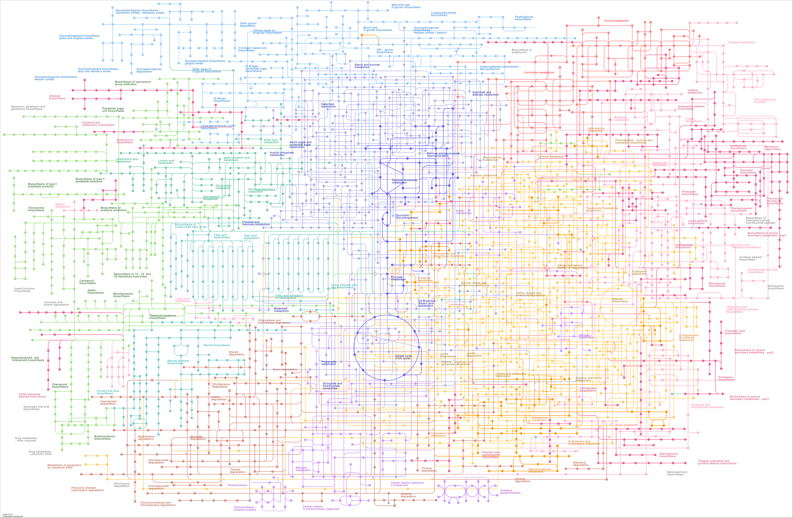

# Metabolic Engineering and Flux Balance Analysis
In this lecture, we are going to introduce metabolic engineering and flux balance analysis (FBA). Metabolic engineering is the practice of optimizing genetic and regulatory processes within cells to increase the production of a certain substance. Flux Balance Analysis (FBA) is a mathematical approach for analyzing the flow of metabolites through a metabolic network. It allows us to understand how changes in the metabolic network can affect the production of a desired compound.

> __Learning Objectives:__
> 
> By the end of this lecture, you should be able to define and explain:
>
> * __Metabolic networks and the stoichiometric matrix:__ Describe how biochemical reactions in a metabolic network are encoded as a stoichiometric matrix, and interpret the sign convention for stoichiometric coefficients.
> * __Flux balance analysis formulation:__ Write the FBA linear program with an objective function, steady-state mass balance constraints, and flux bounds, and identify the role of each component.
> * __Flux bounds model:__ Explain the general flux bounds model in terms of maximum reaction velocity, reversibility, allosteric activity, and substrate saturation, and apply the simplified bounds model.

Let's get started!
___

## Examples
Today, we will use the following examples to illustrate key concepts:

> [▶ Let's download and look at some stoichiometric matrices](CHEME-5430-Example-SVD-StoichiometricMatrix-Spring-2026.ipynb). In this example, we will download and look at some stoichiometric matrices. We will also perform a singular value decomposition (SVD) of the stoichiometric matrix to understand its properties better (advanced topic, but it is interesting to see how it works).

> [▶ Let's do a simple flux balance analysis calculation](CHEME-5450-Example-Solution-UreaCycle-S2026.ipynb). In this example, we will perform a simple flux balance analysis calculation on a small metabolic network, the urea cycle. We will use [the open source GLPK solver](https://www.gnu.org/software/glpk/) to solve the linear program.
___

## Metabolic Engineering

  

    
  

> __What is metabolic engineering?__
>
> Metabolic engineering is the directed modification of an organism's metabolic pathways — using recombinant DNA and other genetic tools — to increase the production of a desired compound or to enable the synthesis of entirely new products. At its core, the field asks: given a metabolic network, how do we redirect the flow of carbon, nitrogen, and energy toward a target molecule? The two landmark papers that defined the field were published together in the same issue of _Science_ in 1991:
> * [Bailey JE. Toward a science of metabolic engineering. Science. 1991 Jun 21;252(5013):1668-75. doi: 10.1126/science.2047876. PMID: 2047876.](https://pubmed.ncbi.nlm.nih.gov/2047876/)
> * [Stephanopoulos G, Vallino JJ. Network rigidity and metabolic engineering in metabolite overproduction. Science. 1991 Jun 21;252(5013):1675-81. doi: 10.1126/science.1904627. PMID: 1904627.](https://pubmed.ncbi.nlm.nih.gov/1904627/)

Central to metabolic engineering is the concept of metabolic flux — the rate at which material flows through the reactions of a network. We describe and analyze these fluxes mathematically using flux balance analysis (FBA), which we introduce in the next section.

## Flux Balance Analysis

### Metabolic networks and the stoichiometric matrix
A metabolic network encompasses all the chemical reactions associated with metabolism, i.e., the breakdown of raw materials such as sugars ([catabolism](https://en.wikipedia.org/wiki/Catabolism)) and the production of macromolecules, e.g., DNA, RNA, proteins, lipids, etc ([anabolism](https://en.wikipedia.org/wiki/Anabolism)). These networks are curated for thousands of organisms and are available in various online databases. 

Let's check out a few of these online metabolic databases:
* [Minoru Kanehisa, Miho Furumichi, Yoko Sato, Yuriko Matsuura, Mari Ishiguro-Watanabe, KEGG: biological systems database as a model of the real world, Nucleic Acids Research, Volume 53, Issue D1, 6 January 2025, Pages D672–D677, https://doi.org/10.1093/nar/gkae909](https://academic.oup.com/nar/article/53/D1/D672/7824602)
* [Karp PD, Billington R, Caspi R, Fulcher CA, Latendresse M, Kothari A, Keseler IM, Krummenacker M, Midford PE, Ong Q, Ong WK, Paley SM, Subhraveti P. The BioCyc collection of microbial genomes and metabolic pathways. Brief Bioinform. 2019 Jul 19;20(4):1085-1093. doi: 10.1093/bib/bbx085. PMID: 29447345; PMCID: PMC6781571.](https://pubmed.ncbi.nlm.nih.gov/29447345/)
* [Charles J Norsigian, Neha Pusarla, John Luke McConn, James T Yurkovich, Andreas Dräger, Bernhard O Palsson, Zachary King, BiGG Models 2020: multi-strain genome-scale models and expansion across the phylogenetic tree, Nucleic Acids Research, Volume 48, Issue D1, 08 January 2020, Pages D402–D406, https://doi.org/10.1093/nar/gkz1054](https://academic.oup.com/nar/article/48/D1/D402/5614178)

There are many other databases with information about enzymes and other biological numbers that we may be interested in:
* [Antje Chang, Lisa Jeske, Sandra Ulbrich, Julia Hofmann, Julia Koblitz, Ida Schomburg, Meina Neumann-Schaal, Dieter Jahn, Dietmar Schomburg, BRENDA, the ELIXIR core data resource in 2021: new developments and updates, Nucleic Acids Research, Volume 49, Issue D1, 8 January 2021, Pages D498–D508, https://doi.org/10.1093/nar/gkaa1025](https://academic.oup.com/nar/article/49/D1/D498/5992283)
* [Ron Milo, Paul Jorgensen, Uri Moran, Griffin Weber, Michael Springer, BioNumbers—the database of key numbers in molecular and cell biology, Nucleic Acids Research, Volume 38, Issue suppl_1, 1 January 2010, Pages D750–D753, https://doi.org/10.1093/nar/gkp889](https://academic.oup.com/nar/article/38/suppl_1/D750/3112244)

#### Stoichiometric matrix
Suppose we have a set of biochemical reactions $\mathcal{R}$ involving chemical species (metabolite) set $\mathcal{M}$. Then, the stoichiometric matrix is a $\mathbf{S}\in\mathbb{R}^{|\mathcal{M}|\times|\mathcal{R}|}$ matrix, where $|\mathcal{M}|$ denotes the number of chemical species and $|\mathcal{R}|$ denotes the number of reactions. The elements of the stoichiometric matrix $\sigma_{ij}\in\mathbf{S}$ are stoichiometric coefficients  such that:
* $\sigma_{ij}>0$: Chemical species (metabolite) $i$ is _produced_ by reaction $j$. Species $i$ is a product of reaction $j$.
* $\sigma_{ij} = 0$: Chemical species (metabolite) $i$ is not connected with reaction $j$
* $\sigma_{ij}<0$: Chemical species (metabolite) $i$ is _consumed_ by reaction $j$. Species $i$ is a reactant of reaction $j$.

The stoichiometric matrix $\mathbf{S}$ is the digital representation of the biochemistry occurring inside some volume, i.e., inside the cell, in a test tube in the case of cell-free systems, or some abstract volume such as a compartment or pseudo compartment of interest.

> __Example:__
> 
> Let's download (and construct) a few stoichiometric matrices from [the BiGG database](http://bigg.ucsd.edu/) and check out their properties.
> 
> [▶ Let's download and look at some stoichiometric matrices](CHEME-5430-Example-SVD-StoichiometricMatrix-Spring-2026.ipynb). In this example, we will download and look at some stoichiometric matrices. We will also perform a singular value decomposition (SVD) of the stoichiometric matrix to understand its properties better (advanced topic, but it is interesting to see how it works). 

___

### Flux Balance Analysis Formulation
Flux balance analysis (FBA) is a mathematical approach used to analyze the flow of metabolites through a metabolic network. It assumes a steady state where metabolite production, consumption, and transport rates are balanced. 

> __General Flux Balance Analysis (FBA) Formulation__
>
> The FBA problem is formulated as a linear programming (LP) problem to maximize or minimize fluxes through the network, subject to constraints. The linear program for estimating the (unknown) fluxes $\hat{v}_{i}$ through the reactions in the network can be written as:
> $$
> \begin{align*}
> \texttt{maximize}\quad&  \sum_{i\in\mathcal{R}}c_{i}\hat{v}_{i}\\
> \text{subject to}\quad & \sum_{s\in\mathcal{S}}d_{s}C_{i,s}\dot{V}_{s} + \sum_{j\in\mathcal{R}}\sigma_{ij}\hat{v}_{j}V = \frac{d}{dt}\left(C_{i}V\right)\qquad\forall{i\in\mathcal{M}}\\
> & \mathcal{L}_{j}\leq\hat{v}_{j}\leq\mathcal{U}_{j}\qquad\forall{j\in\mathcal{R}}
> \end{align*}
> $$
> Here, $\sigma_{ij}\in\mathbf{S}$, the $c_{i}$ terms are objective coefficients (you choose), $\hat{v}_{i}$ are unknown fluxes (what we want to estimate), and $\mathcal{L}_{j}$ and $\mathcal{U}_{j}$ are the lower and upper flux bounds, respectively.

Let's look at the following references to understand the different components of a flux balance analysis problem and the computational tools available:

* [Orth, J., Thiele, I. & Palsson, B. What is flux balance analysis?. Nat Biotechnol 28, 245–248 (2010). https://doi.org/10.1038/nbt.1614](https://www.ncbi.nlm.nih.gov/labs/pmc/articles/PMC3108565/)
* [Heirendt, Laurent et al. "Creation and analysis of biochemical constraint-based models using the COBRA Toolbox v.3.0." Nature Protocols vol. 14,3 (2019): 639-702. doi:10.1038/s41596-018-0098-2](https://pubmed.ncbi.nlm.nih.gov/30787451/)

In the [Palsson 2010 reference](https://www.ncbi.nlm.nih.gov/labs/pmc/articles/PMC3108565/), the authors show a different formulation of the FBA problem. [Let's check it out and see how it compares to the formulation we have above.](CHEME-5430-Advanced-Derivation-FluxBalanceAnalysis-Spring-2026.ipynb)

___

## A model for flux bounds
The flux bounds are important constraints in flux balance analysis calculations and the convex decomposition of the stoichiometric array. Beyond their role in the flux estimation problem, the flux bounds are _integrative_, i.e., these constraints integrate many types of genetic and biochemical information into the problem. A general model for these bounds is given by:
$$
\begin{align*}
-\delta_{j}\underbrace{\left[{V_{max,j}^{\circ}}\left(\frac{e}{e^{\circ}}\right)\theta_{j}\left(\dots\right){f_{j}\left(\dots\right)}\right]}_{\text{reverse: other functions or parameters?}}\leq\hat{v}_{j}\leq{V_{max,j}^{\circ}}\left(\frac{e}{e^{\circ}}\right)\theta_{j}\left(\dots\right){f_{j}\left(\dots\right)}
\end{align*}
$$
where $V_{max,j}^{\circ}$ denotes the maximum reaction velocity (units: `flux`) computed at some _characteristic enzyme abundance_. Thus, the maximum reaction velocity is given by:
$$
V_{max,j}^{\circ} = k_{cat,j}^{\circ}e^{\circ}
$$
where $k_{cat,j}$ is the catalytic constant or turnover number for the enzyme (units: `1/time`) and $e^{\circ}$ is a characteristic enzyme abundance (units: `concentration`). The term $\left(e/e^{\circ}\right)$ is a correction to account for the _actual_ enzyme abundance catalyzing the reaction (units: `dimensionless`). 

The $\theta_{j}\left(\dots\right)\in\left[0,1\right]$ is the current fraction of maximal enzyme activity of enzyme $e$ in reaction $j$. The activity model $\theta_{j}\left(\dots\right)$ describes [allosteric effects](https://en.wikipedia.org/wiki/Allosteric_regulation) on the reaction rate, and is a function of the regulatory and the chemical state of the system, the concentration of substrates, products, and cofactors (units: `dimensionless`). Finally, the $f_{j}\left(\dots\right)$ is a function describing the substrate (reactants) dependence of the reaction rate $j$ (units: `dimensionless`). 

> __What do we need to estimate to use this model for the flux bounds?__
>
> * __Parameters__: We need estimates for the $k_{cat,j}^{\circ}$ for all enzymes in the system we are interested in and a _reasonable policy_ for specifying a characteristic value for $e^{\circ}$. In addition, the $\theta_{j}\left(\dots\right)$ and $f_{j}\left(\dots\right)$ models can also have associated parameters, e.g., saturation or binding constants, etc. Thus, we need to estimate these from literature studies or experimental data.
> * __Reversibility__: Next, we need to estimate the binary direction parameter $\delta_{j}\in\left\{0,1\right\}$. The value of $\delta_{j}$ describes the reversibility of reaction $j$; if reaction $j$ is __reversible__ $\delta_{j}=1$. If reaction $j$ is __irreversible__ $\delta_{j}=0$
> 
> Seems like a lot of work, right? Yes, it is. However, we can make some simplifying assumptions to make this problem more tractable.

### Simplified bounds model
Let's initially assume that $(e/e^{\circ})\sim{1}$, there are no allosteric inputs $\theta_{j}\left(\dots\right)\sim{1}$, and the substrates are saturating $f_{j}\left(\dots\right)\sim{1}$. 
Then, the flux bounds are given by:
$$
\begin{align*}
-\delta_{j}V_{max,j}^{\circ}\leq{\hat{v}_{j}}\leq{V_{max,j}^{\circ}}
\end{align*}
$$
This is a simple model for the flux bounds. It is easy to see that the flux bounds are a function of the maximum reaction velocity, the catalytic constant or turnover number, and our assumed value of a characteristic enzyme abundance.

> __Example__
>
> [▶ Let's do a simple flux balance analysis calculation](CHEME-5450-Example-Solution-UreaCycle-S2026.ipynb). In this example, we will perform a simple flux balance analysis calculation on a small metabolic network, the urea cycle. We will use [the open source GLPK solver](https://www.gnu.org/software/glpk/) to solve the linear program.

___

## Summary
Flux balance analysis estimates metabolic fluxes by solving a linear program with steady-state mass balance constraints and flux bounds derived from kinetic and biological information.

> __Key Takeaways:__
>
> * **Stoichiometric matrix:** The stoichiometric matrix encodes the complete connectivity of a metabolic network, where each element represents the stoichiometric coefficient of a species in a reaction.
> * **FBA formulation:** FBA estimates metabolic fluxes by maximizing an objective function subject to steady-state mass balance constraints and flux bounds.
> * **Flux bounds model:** Flux bounds integrate kinetic, genetic, and regulatory information into the FBA problem through the maximum reaction velocity, reversibility parameter, allosteric activity, and substrate saturation functions.

The simplified bounds model, where enzyme concentrations are at characteristic levels with no allosteric effects and saturating substrates, provides a tractable starting point for FBA calculations.
___
