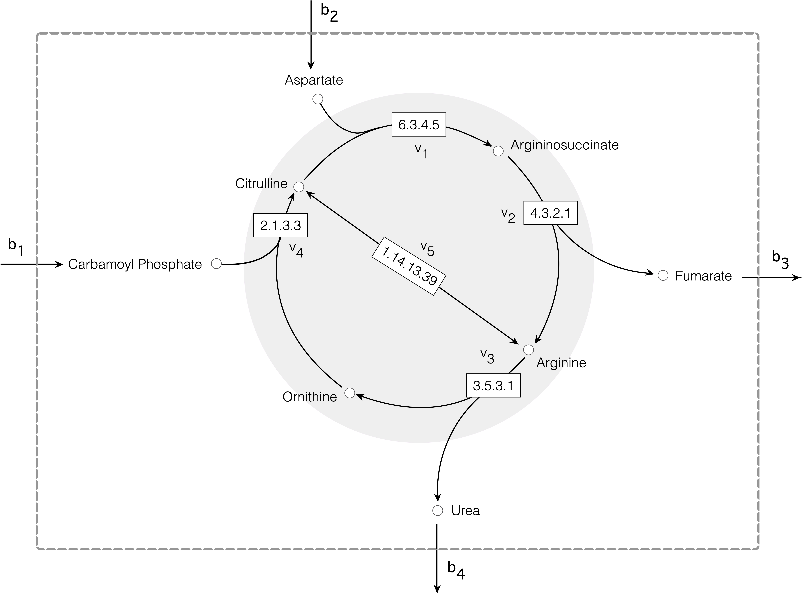

# Problem Set 2 (PS2): Flux Balance Analysis of the Urea Cycle in HL-60 Cells

The [urea cycle](https://www.kegg.jp/pathway/hsa00220) converts toxic ammonia into urea for excretion. It is a small, well-characterized metabolic network — five enzyme-catalyzed reactions — which makes it a good first system to apply flux balance analysis to. In this problem set, we'll build an FBA model of the urea cycle in [HL-60 cells](https://www.atcc.org/products/ccl-240), estimate the flux bounds from thermodynamic and kinetic data, and solve the linear program to find the flux distribution that maximizes urea production.

__Why does this matter?__ FBA requires two pieces of biological information beyond the network structure: the reversibility of each reaction and the maximum rate each enzyme can operate. Getting these right determines whether the model is feasible and biologically meaningful. Working through this problem set, you'll see exactly how thermodynamic data (from [eQuilibrator](https://equilibrator.weizmann.ac.il)) and kinetic data (from [BRENDA](https://www.brenda-enzymes.org/)) feed into the bounds, and how small errors in either can make the problem infeasible.

> __Learning Objectives:__
>
> By the end of this problem set, you will be able to:
>
> * __Construct an FBA model from a reaction network:__ Build a stoichiometric matrix and flux balance analysis model from a flat-file reaction network for the urea cycle.
> * __Estimate flux bounds from biological data:__ Use [eQuilibrator](https://equilibrator.weizmann.ac.il) to estimate reaction reversibility and [BRENDA](https://www.brenda-enzymes.org/) to estimate maximum reaction velocities, then apply these to set flux bounds.
> * __Solve and interpret the FBA linear program:__ Formulate and solve the FBA optimization problem to compute the flux distribution that maximizes urea export, and identify the rate-limiting step.

### Tasks
In PS2, we'll construct [a simplified model of the urea cycle](https://github.com/varnerlab/CHEME-5450-Lectures-Spring-2025/blob/main/lectures/week-5/L5c/docs/figs/Fig-Urea-cycle-Schematic.pdf), determine the reversibility of the reactions, estimate the flux bounds, and compute the optimal flux distribution that maximizes Urea production. Start with the setup section and work through the notebook. `TODO` statements indicate that you need to complete something.

Let's get started!

### References
1. [Al-Otaibi NAS, Cassoli JS, Martins-de-Souza D, Slater NKH, Rahmoune H. Human leukemia cells (HL-60) proteomic and biological signatures underpinning cryo-damage are differentially modulated by novel cryo-additives. Gigascience. 2019 Mar 1;8(3):giy155. doi: 10.1093/gigascience/giy155. PMID: 30535373; PMCID: PMC6394207.](https://pmc.ncbi.nlm.nih.gov/articles/PMC6394207/)
2. [Figarola JL, Weng Y, Lincoln C, Horne D, Rahbar S. Novel dichlorophenyl urea compounds inhibit proliferation of human leukemia HL-60 cells by inducing cell cycle arrest, differentiation and apoptosis. Invest New Drugs. 2012 Aug;30(4):1413-25. doi: 10.1007/s10637-011-9711-8. Epub 2011 Jul 5. PMID: 21728022.](https://pubmed.ncbi.nlm.nih.gov/21728022/)
3. [Caldwell RW, Rodriguez PC, Toque HA, Narayanan SP, Caldwell RB. Arginase: A Multifaceted Enzyme Important in Health and Disease. Physiol Rev. 2018 Apr 1;98(2):641-665. doi: 10.1152/physrev.00037.2016. PMID: 29412048; PMCID: PMC5966718.](https://pmc.ncbi.nlm.nih.gov/articles/PMC5966718/)

___

<div>
  <center>
    
  </center>
</div>

## Setup, Data, and Prerequisites
We set up the computational environment by including the `Include.jl` file and loading any needed resources.

> __Environment Setup with `Include.jl`__
>
> The [`include(...)` command](https://docs.julialang.org/en/v1/base/base/#include) evaluates the contents of the input source file, `Include.jl`, in the notebook's global scope. The `Include.jl` file sets paths, loads required external packages, custom types, and functions used in this exercise. It checks for a `Manifest.toml` file; if one is found, packages are loaded from it. Otherwise, packages are downloaded and loaded.

Let's set up our code environment:


```julia
include("Include.jl");
```

## Task 1: Build the FBA model
The first step is to load the reaction network from the `Network.net` file and build an FBA model. The network file encodes the five urea cycle reactions and the exchange reactions in a simple text format. From this, we build a stoichiometric matrix $\mathbf{S}$, a species list, a reaction list, and a default flux bounds array.

> __What does the model contain?__
>
> We store all problem data in a `MyPrimalFluxBalanceAnalysisCalculationModel` instance. The key fields are:
> * `S` — the stoichiometric matrix $\mathbf{S}\in\mathbb{R}^{|\mathcal{M}|\times|\mathcal{R}|}$
> * `fluxbounds` — a $|\mathcal{R}|\times 2$ array of lower and upper bounds for each flux
> * `species` and `reactions` — ordered lists that map rows and columns of `S` to metabolite and reaction names
> * `objective` — the coefficient vector $\mathbf{c}$ for the linear objective (initially all zeros)
>
> We also return `rd::Dict{String, String}`, which maps each reaction name to its reaction string — useful for reading the flux table later.

We'll use [the `build(...)` factory method](src/Factory.jl) to construct the model from a `NamedTuple` of data. A [let block](https://docs.julialang.org/en/v1/manual/variables-and-scoping/#Let-Blocks) keeps intermediate variables private — only `model` and `rd` are returned.

__Build the model__: Let's load the network and construct the model:


```julia
model, rd = let

    # first, load the reaction file - and process it
    listofreactions = read_reaction_file(joinpath(_PATH_TO_DATA, "Network.net")); # load the reactions from the VFF reaction file
    S, species, reactions, rd = build_stoichiometric_matrix(listofreactions); # Builds the stochiometric matrix, species list, and the reactions list
    boundsarray = build_default_bounds_array(listofreactions); # Builds a default bounds model using the flat file flags

    # build the FBA model -
    model = build(MyPrimalFluxBalanceAnalysisCalculationModel, (
        S = S, # stoichiometric matrix
        fluxbounds = boundsarray, # these are the *default* bounds, we'll need to update with new info if we have it
        species = species, # list of species. The rows of S are in this order
        reactions = reactions, # list of reactions. The cols of S are in this order
        objective = length(reactions) |> R -> zeros(R), # this is empty, we'll need to set this
    ));

    # return -
    model, rd
end;
```

## Task 2: Update the flux bounds
With the model built, we need to update the flux bounds. The default bounds from the network file are coarse placeholders. We'll replace them with bounds derived from real thermodynamic and kinetic data.

The flux bounds follow the simplified model:
$$
\begin{align*}
-\delta_{j}V_{max,j}^{\circ}\leq\hat{v}_{j}\leq{V_{max,j}^{\circ}}
\end{align*}
$$
where $V_{max,j}^{\circ} = k_{cat,j}^{\circ}e^{\circ}$ is the maximum reaction velocity at a characteristic enzyme abundance $e^{\circ}$, and $\delta_{j}\in\{0,1\}$ is the reversibility parameter. This simplified model assumes the enzyme is at its characteristic abundance, with no allosteric effects and saturating substrates.

> __What do we need to estimate?__
>
> Two quantities per reaction:
> * __Reversibility__ $\delta_{j}$: Is the reaction thermodynamically reversible under cellular conditions? We estimate this from $\Delta G$ values using [eQuilibrator](https://equilibrator.weizmann.ac.il). If $\Delta G_j > -10$ kJ/mol, the reaction is reversible ($\delta_j = 1$); otherwise irreversible ($\delta_j = 0$).
> * __Maximum velocity__ $V_{max,j}^{\circ}$: What is the fastest this enzyme can operate? We estimate $k_{cat,j}^{\circ}$ from [BRENDA](https://www.brenda-enzymes.org/) and compute $V_{max,j}^{\circ} = k_{cat,j}^{\circ} \cdot e^{\circ}$.

We'll complete this in three steps: estimate $\delta_j$, estimate $V_{max,j}^{\circ}$, then combine them to update the bounds array.

### Step 1: Estimate the reversibility parameters $\delta_{j}$

> Use [eQuilibrator](https://equilibrator.weizmann.ac.il) to look up the standard Gibbs free energy $\Delta G_j$ for each of the `5` enzyme-catalyzed reactions. Search by EC number using the prefix format (e.g., `EC 6.3.4.5`) and use the superscript `m` value. Then apply the threshold rule: if $\Delta G_j > -10.0$ kJ/mol, the reaction is reversible ($\delta_j = 1$); otherwise it is irreversible ($\delta_j = 0$).
>
> * [Beber ME, Gollub MG, Mozaffari D, Shebek KM, Flamholz AI, Milo R, Noor E. eQuilibrator 3.0: a database solution for thermodynamic constant estimation. Nucleic Acids Res. 2022 Jan 7;50(D1):D603-D609. doi: 10.1093/nar/gkab1106. PMID: 34850162; PMCID: PMC8728285.](https://pubmed.ncbi.nlm.nih.gov/34850162/)

Store the results in `reversibility_parameter_dictionary::Dict{String, Int}`, mapping reaction name (key) to $\delta_{j}$ (value). Exchange reactions (names containing `b`) are skipped — they are always treated as reversible with large default bounds.

`TODO`: Fill in the `ΔG` array with values from [eQuilibrator](https://equilibrator.weizmann.ac.il):


```julia
reversibility_parameter_dictionary = let

    # initialize -
    ΔḠ = -10.0; # threshold value, units: kJ/mol -
    names = model.reactions; # get an array of the names of the reactions (includes exchange)
    reversibility_parameter_dictionary = Dict{String, Int}();

    # TODO: build a ΔG array for the reactions in the model
    ΔG = [
        -4.3 ; # 1 v₁ EC 6.3.4.5 value: -4.3 ± 2.9 kJ/mol
        -5.5 ; # 2 v₂ EC 4.3.2.1 value: -5.5 ± 5.7 kJ/mol
        -51.0 ; # 3 v₃ EC 3.5.3.1 value: -51 ± 12.4 kJ/mol
        -30.3 ; # 4 v₄ EC 2.1.3.3 value: -30.3 ± 5.7 kJ/mol 
        -1220.2 ; # 5 v₅ EC 1.15.13.39 value: -1220.2 ± 29.6 kJ/mol
    ];

    # compute loop -
    for i ∈ eachindex(names)
        name = names[i]; # get the reaction name for reaction i -

        # check: do we have an exchange flux? If so: skip
        if (contains(name, "b") == true)
            continue;
        end
        
        ΔGᵢ = ΔG[i]; # get the ΔG value for reaction i -
        
        # if ΔGᵢ > ΔḠ (less negative than threshold) → reversible (δ=1)
        # if ΔGᵢ < ΔḠ (more negative than threshold) → irreversible (δ=0)
        δᵢ = sign(ΔGᵢ - ΔḠ) == 1 ? 1 : 0

        # store -
        reversibility_parameter_dictionary[name] = δᵢ; # stores the reversibility parameter with key name
    end

    
    # return -
    reversibility_parameter_dictionary;
end;
```

### Step 2: Estimate the maximum reaction velocities $V_{max,j}^{\circ}$

Now that we have the reversibility parameters, we need $V_{max,j}^{\circ} = k_{cat,j}^{\circ} \cdot e^{\circ}$ for each reaction. We look up $k_{cat,j}^{\circ}$ from [BRENDA](https://www.brenda-enzymes.org/) using the EC number. Not all enzymes have reported turnover numbers in BRENDA — for those, we use a characteristic default value of $k_{cat,j}^{\circ} = 10$ `1/s`.

> __What value should we use for $e^{\circ}$?__
>
> We assume a characteristic enzyme abundance of $e^{\circ} = 0.01$ `μmol/gDW` for all reactions. This is a reasonable order-of-magnitude estimate for a typical enzyme in a mammalian cell. Note that the actual enzyme abundance in HL-60 cells is unknown, so this assumption introduces uncertainty into our bounds — a limitation worth keeping in mind when interpreting the FBA results.
>
> * [Antje Chang et al., BRENDA, the ELIXIR core data resource in 2021: new developments and updates, Nucleic Acids Research, Volume 49, Issue D1, 8 January 2021, Pages D498–D508, https://doi.org/10.1093/nar/gkaa1025](https://academic.oup.com/nar/article/49/D1/D498/5992283)

Store the results in `maximum_reaction_velocity_dictionary::Dict{String, Float64}`, mapping reaction name (key) to $V_{max,j}^{\circ}$ (value).

`TODO`: Fill in the `kcat` array with values from [BRENDA](https://www.brenda-enzymes.org/):


```julia
maximum_reaction_velocity_dictionary = let

    # initialize -
    eₒ = 0.01; # characteristic enzyme abundance units: mmol/gDW
    kₒ = 10.0; # characteristic turnover rate units: 1/s (use this if we don't have a specific value from BRENDA)
    names = model.reactions; # get an array of the names of the reactions (includes exchange)
    maximum_reaction_velocity_dictionary = Dict{String, Float64}();

    # TODO: **Update** the kcat array for the reactions in the model with values from BRENDA
    kcat = [
        kₒ ;   # 1 v₁ EC 6.3.4.5 No value, use default
        3.28 ; # 2 v₂ EC 4.3.2.1 value: 3.28 1/s
        190.0 ;# 3 v₃ EC 3.5.3.1 value: 190 1/s
        410.0 ;# 4 v₄ EC 2.1.3.3 value: 410 1/s E. coli value. Good choice?
        kₒ ;   # 5 v₅ EC 1.15.13.39 No value, use default
    ];

    # compute loop -
    for i ∈ eachindex(names)
        name = names[i]; # get the reaction name for reaction i -

        # check: do we have an exchange flux? If so: skip
        if (contains(name, "b") == true)
            continue;
        end
        
        # compute the VMaxᵢ -
        VMaxᵢ = kcat[i]*eₒ;

        # store -
        maximum_reaction_velocity_dictionary[name] = VMaxᵢ; # stores the VMax with key name
    end
    
    # return -
    maximum_reaction_velocity_dictionary;
end;
```

### Step 3: Update the flux bounds array

With $\delta_j$ and $V_{max,j}^{\circ}$ in hand, we can now update the bounds. For each enzyme-catalyzed reaction, the lower bound is $-\delta_j V_{max,j}^{\circ}$ and the upper bound is $V_{max,j}^{\circ}$. Exchange reactions keep their default large bounds ($\pm 1000$) since they represent unconstrained exchange with the surroundings.

> __What happens if the bounds are wrong?__
>
> If the lower bound is set incorrectly — for example, using $+\delta_j V_{max,j}^{\circ}$ instead of $-\delta_j V_{max,j}^{\circ}$ — then for reversible reactions the lower bound equals the upper bound, forcing the flux to a single value. Combined with the steady-state constraint $\mathbf{S}\hat{\mathbf{v}} = \mathbf{0}$, this almost always produces an infeasible problem. If you see an `AssertionError` in the solve step below, check your bounds first.

`TODO`: Fill in the lower and upper bound assignments in the loop below:


```julia
fluxbounds = let
    
    fluxbounds = model.fluxbounds;
    names = model.reactions;
    for i ∈ eachindex(names)
        name = names[i]; # get the reaction name for reaction i -
    
        # check: do we have an exchange flux? If so: skip
        if (contains(name, "b") == true)
            continue;
        end
        
        VMax = maximum_reaction_velocity_dictionary[name]; # what is the maximum velocity for this reaction?
        δᵢ = reversibility_parameter_dictionary[name]; # what is the reversibility parameter for this reaction?
    
        # update the bounds: lower bound is -δᵢ*VMax (negative for reversible reactions)
        fluxbounds[i,1] = -δᵢ*VMax; # lower bound
        fluxbounds[i,2] = VMax; # upper bound
    end

    # return -
    fluxbounds;
end;
```


```julia
model.fluxbounds = fluxbounds;
```

### Step 4: Set the objective function

The last piece before solving is specifying what we want to optimize. By default, all objective coefficients are `0.0`, which means no objective — the solver would return any feasible flux. We want to _maximize_ the export of urea from the system, which corresponds to maximizing the flux through the exchange reaction `b4` (the urea export reaction).

> __Why set the objective coefficient to `-1`?__
>
> [JuMP](https://jump.dev/) (the optimization package we use) minimizes by default. To maximize the flux through `b4`, we set its objective coefficient to `-1`. Minimizing $-\hat{v}_{b4}$ is equivalent to maximizing $\hat{v}_{b4}$.

`TODO`: Specify the reaction to maximize in `reaction_to_maximize` below:


```julia
objective = model.objective;
reaction_to_maximize = "b4"; # TODO: specify the reaction to maximize (use the reaction name)
findfirst(x-> x==reaction_to_maximize, model.reactions) |> i -> objective[i] = -1; # why negative 1? because we're maximizing the flux through the reaction
```

## Task 3: Solve the FBA problem
We now have everything we need: the stoichiometric matrix $\mathbf{S}$, the updated flux bounds, and the objective function. We solve the FBA linear program by passing the `model` to [the `solve(...)` method](src/Compute.jl).

> __What does the solver return?__
>
> If the problem is feasible and bounded, `solve(...)` returns a `solution::Dict{String, Any}` dictionary with:
> * `solution["argmax"]` — the optimal flux vector $\hat{\mathbf{v}}^{*}$
> * `solution["objective"]` — the optimal objective value (maximum urea export rate)
>
> If the problem is infeasible, `solve(...)` throws an `AssertionError`. The `try-catch` block below catches this and prints the error so you can diagnose the issue — most commonly a bounds error from Task 2. See [is_solved_and_feasible](https://jump.dev/JuMP.jl/stable/api/JuMP/#JuMP.is_solved_and_feasible) in the JuMP documentation for more information.

Let's solve:


```julia
solution = let
    
    solution = nothing; # initialize nothing for the solution
    try
        solution = solve(model); # call the solve method with our problem model -
    catch error
        println("error: $(error)"); # Oooooops! Looks like we have a *major malfunction*, problem didn't solve
    end

    # return solution
    solution
end;
```

### Flux table
The flux table shows the optimal flux through every reaction in the model, along with its bounds and reaction equation. Look at this table carefully before answering the discussion questions — it contains everything you need.

> __How to read the flux table:__
>
> * Reactions `v1`–`v5` are the enzyme-catalyzed urea cycle reactions. `b1`–`b14` are exchange reactions.
> * A flux value equal to the upper bound (UB) means that reaction is operating at its maximum — it may be rate-limiting.
> * A flux of `0.0` means the reaction is not used in the optimal solution.
> * Negative exchange fluxes mean the metabolite is being _exported_ from the system; positive means _imported_.

`Unhide` the code block below to see the flux table:


```julia
flux_table = let

    # setup -
    S = model.S;
    flux_bounds_array = model.fluxbounds;
    number_of_reactions = size(S, 2);
    flux = solution["argmax"];

    # build DataFrame -
    df = DataFrame(
        reaction  = model.reactions,
        flux      = flux,
        LB        = flux_bounds_array[:, 1],
        UB        = flux_bounds_array[:, 2],
        equation  = [rd[r] for r in model.reactions]
    );

    # let's make a pretty table -
    pretty_table(
        df;
        fit_table_in_display_vertically = false,
        fit_table_in_display_horizontally = false,
        backend = :text,
        alignment = [:l, :r, :r, :r, :l],  # last column left-justified
        table_format = TextTableFormat(borders = text_table_borders__compact)
    );
end
```

     ---------- --------- --------- --------- ----------------------------------------------------------------------------------------------------------------
      reaction      flux        LB        UB   equation                                                                                                       
      String     Float64   Float64   Float64   String                                                                                                         
     ---------- --------- --------- --------- ----------------------------------------------------------------------------------------------------------------
      v1          0.0328      -0.1       0.1   M_ATP_c+M_L-Citrulline_c+M_L-Aspartate_c = M_AMP_c+M_Diphosphate_c+M_N-(L-Arginino)succinate_c
      v2          0.0328   -0.0328    0.0328   M_N-(L-Arginino)succinate_c = M_Fumarate_c+M_L-Arginine_c
      v3          0.0328       0.0       1.9   M_L-Arginine_c+M_H2O_c = M_L-Ornithine_c+M_Urea_c
      v4          0.0328       0.0       4.1   M_Carbamoyl_phosphate_c+M_L-Ornithine_c = M_Orthophosphate_c+M_L-Citrulline_c
      v5             0.0       0.0       0.1   2*M_L-Arginine_c+4*M_Oxygen_c+3*M_NADPH_c+3*M_H_c = 2*M_Nitric_oxide_c+2*M_L-Citrulline_c+3*M_NADP_c+4*M_H2O_c
      b1          0.0328   -1000.0    1000.0   [] = M_Carbamoyl_phosphate_c
      b2          0.0328   -1000.0    1000.0   [] = M_L-Aspartate_c
      b3         -0.0328   -1000.0    1000.0   [] = M_Fumarate_c
      b4         -0.0328   -1000.0    1000.0   [] = M_Urea_c
      b5          0.0328   -1000.0    1000.0   [] = M_ATP_c
      b6         -0.0328   -1000.0    1000.0   [] = M_AMP_c
      b7         -0.0328   -1000.0    1000.0   [] = M_Diphosphate_c
      b8         -0.0328   -1000.0    1000.0   [] = M_Orthophosphate_c
      b9             0.0   -1000.0    1000.0   [] = M_Oxygen_c
      b10            0.0   -1000.0    1000.0   [] = M_NADPH_c
      b11            0.0   -1000.0    1000.0   [] = M_H_c
      b12            0.0   -1000.0    1000.0   [] = M_Nitric_oxide_c
      b13            0.0   -1000.0    1000.0   [] = M_NADP_c
      b14         0.0328   -1000.0    1000.0   [] = M_H2O_c
     ---------- --------- --------- --------- ----------------------------------------------------------------------------------------------------------------


```julia
do_I_see_the_flux_table = true; # TODO: update this flag to {true | false} if the flux table is visible
```

## Discussion
Use your flux table and simulation results to answer the following questions. There are no single right answers — use the data to support your reasoning.

> __Things to think about before answering:__
>
> * Which reactions are carrying flux in the optimal solution, and which are silent?
> * Which reaction is operating at its upper bound? What does that tell you about the rate-limiting step?
> * What metabolites are being imported or exported? Do those make sense given the urea cycle stoichiometry?
> * What would happen to the urea production rate if the rate-limiting enzyme's $k_{cat}$ were doubled?

__DQ1__: What is the maximum rate of Urea export from the system using your updated model parameters, and what species are exported or imported into the system to support this production level?


```julia
# Put your answer to DQ1 (either as a commented code cell, or as a markdown cell)
```


```julia
did_I_answer_DQ1 = true; # update to true if answered DQ1 {true | false}
```

__DQ2__: Given your updated model parameters, is there a rate-limiting step controlling the rate of Urea production?


```julia
# Put your answer to DQ2 (either as a commented code cell, or as a markdown cell)
```


```julia
did_I_answer_DQ2 = true; # update to true if answered DQ2 {true | false}
```

__DQ3__: Hypothetically, suppose the teaching team measured the rate of oxygen consumption for the Urea cycle in isolation and found this number to be non-zero. What does that say about the reactions occurring inside the Urea cycle system?


```julia
# Put your answer to DQ3 (either as a commented code cell, or as a markdown cell)
```


```julia
did_I_answer_DQ3 = true; # update to true if answered DQ3 {true | false}
```

## Tests
`Unhide` the code block below (if you are curious) about how we implemented the tests and what we are testing. In these tests, we check values in your notebook and give feedback on which items are correct, missing etc.

## Summary
This problem set constructs and solves an FBA problem for the urea cycle, using thermodynamic and kinetic data to set flux bounds and GLPK to find the optimal flux distribution.

> __Key Takeaways:__
>
> * __Flux bounds integrate biological data:__ Reaction reversibility from thermodynamics (eQuilibrator) and maximum velocities from enzyme kinetics (BRENDA) together define the feasible flux space for the FBA problem.
> * __FBA as a linear program:__ The optimal flux distribution is found by solving a linear program subject to steady-state mass balance constraints ($\mathbf{S}\hat{\mathbf{v}} = \mathbf{0}$) and flux bounds.
> * __Rate-limiting steps from FBA:__ The flux solution identifies which reaction constrains overall urea production — the reaction whose flux is at its upper bound limits the objective.

___


```julia
let
    @testset verbose = true "CHEME 5450 problem set 2 test suite" begin
        
        @testset "Setup" begin
            @test isnothing(model) == false
            @test isnothing(rd) == false
            @test isnothing(reversibility_parameter_dictionary) == false
            @test isnothing(maximum_reaction_velocity_dictionary) == false
            @test isnothing(solution) == false

            @test isempty(reversibility_parameter_dictionary) == false
            @test isempty(maximum_reaction_velocity_dictionary) == false

        end

        @testset "Calculation" begin
            @test isempty(solution) == false
            @test do_I_see_the_flux_table == true
        end
        
       @testset "Discussion questions" begin
            @test did_I_answer_DQ1 == true
            @test did_I_answer_DQ2 == true
            @test did_I_answer_DQ3 == true
        end
    end
end;
```

    Test Summary:                       | Pass  Total  Time
    CHEME 5450 problem set 2 test suite |   12     12  0.4s
      Setup                             |    7      7  0.4s
      Calculation                       |    2      2  0.0s
      Discussion questions              |    3      3  0.0s

